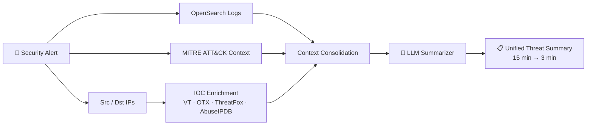

<!-- ===================== HEADER ===================== -->
<div align="center">


<a href="https://git.io/typing-svg">
  
</a>

<br/>

<a href="mailto:nijpadariya@gmail.com"></a>
<a href="https://www.linkedin.com/in/nij-padariya-886ab01b2/"></a>
<a href="https://leetcode.com/u/Nij_Padariya/"></a>
<a href="https://github.com/padariya-tech"></a>

<br/><br/>


</div>

---

## 👨‍💻 About Me

I'm a **Software Development Engineer at IHUB NTIHAC Foundation (C3iHub)**, IIT Kanpur, where I build the backend of a **Cyber Threat Intelligence & Response (CTIR)** platform: ingesting, enriching, and making sense of security data at scale.

I hold an **M.Tech in Computer Science & Engineering from IIT Kanpur** and sit at the intersection of **backend engineering, system design, and applied AI**. I like turning slow, messy, manual workflows into fast, clean, automated ones.

```python
class NijPadariya:
    role       = "Software Development Engineer @ C3iHub, IIT Kanpur"
    education  = ["M.Tech CSE, IIT Kanpur (CPI 8.71)", "B.E. IT, GTU (CPI 9.09)"]
    currently  = ["Scaling threat-intel pipelines", "LLM-assisted SOC workflows", "Learning Kafka & event-driven design"]
    strengths  = ["Concurrency", "Connector architectures", "Backend APIs", "Data & ML pipelines"]
    achievement = "AIR 339 in GATE CS 2023 (out of 75,680 candidates)"

    def philosophy(self):
        return "Make it fast. Make it reusable. Make it explainable."
```

---

## 📈 Impact at a Glance

<div align="center">

| 🔢 **1.19M+** | ⚡ **73%** | 🧠 **80%** | 🧩 **35 → 3** | 🗺️ **75** |
|:---:|:---:|:---:|:---:|:---:|
| IOCs ingested & processed | faster IOC enrichment (30s → 8s) | less analyst investigation time (15 → 3 min) | feed-specific files replaced by reusable components | UP districts covered in disease forecasting |

</div>

---

## 💼 Experience

### 🛡️ Software Development Engineer: IHUB NTIHAC Foundation (C3iHub), IIT Kanpur
`Jul 2025 – Present` · **Python · FastAPI · OpenSearch · MySQL · Redis**

- 🔹 Built backend services for the **CTIR platform**, ingesting and processing **1.19M+ IOCs** across IPs, domains, URLs, hashes, vulnerabilities, and security alerts.
- ⚡ **Parallelized IOC enrichment** with `ThreadPoolExecutor` across **VirusTotal, AlienVault OTX, ThreatFox, and AbuseIPDB**: enrichment time dropped from **30s → 8s (73% faster)**.
- 🧩 **Redesigned threat-feed ingestion** into a loosely coupled, connector-driven architecture, replacing **35 feed-specific files with 3 reusable components** and cutting new-feed integration time **from days to hours**.
- 🤖 Built an **LLM-assisted alert investigation workflow** that consolidates OpenSearch logs, MITRE ATT&CK context, source/destination IPs, and IOC enrichment into one unified threat summary, reducing investigation time **from 15 min to 3 min (80%)**.

<details>
<summary><b>🔍 How the alert investigation workflow fits together (click to expand)</b></summary>



</details>

---

## 🚀 Featured Projects

<table>
<tr>
<td width="50%" valign="top">

### 🦠 Disease Surveillance & Forecasting
**M.Tech Thesis** · Guide: Prof. Nisheeth Srivastava, IIT Kanpur

District-level disease forecasting for **75 districts of Uttar Pradesh**, combining surveillance data (May 2023 – Sep 2024) with demographic, environmental, weather, and healthcare data.

- 🧪 Engineered **13+ predictive features** (population, literacy, income, temperature, humidity, land use, healthcare infra, sanitation)
- 🗂️ **K-Means** grouped districts into **6 regional profiles**
- 📊 **Bayesian Hierarchical Linear Regression** (PyMC / MCMC) for probabilistic forecasts **with uncertainty estimates**

`Python` `PyMC` `MCMC` `K-Means` `Pandas`

</td>
<td width="50%" valign="top">

### 🎓 LearnWithSensei: E-Learning Platform
**Self project** · Jun – Aug 2024

Full backend for an online course platform: enrollment, instructor workflows, authentication, payments, and video/content delivery.

- 🔐 Role-based REST APIs for instructors & learners (course creation, uploads, likes, comments, discussions)
- 📈 Handles **500+ requests/min** with **50+ concurrent users**
- ⚡ Query and request-flow tuning gave a **25% drop in API latency**
- ☁️ **AWS S3** for scalable video/content storage

`Java` `Spring Boot` `MongoDB` `AWS S3`

</td>
</tr>
<tr>
<td width="50%" valign="top">

### 🏏 IPL Data Analytics & Processing
**Course project** · Jan – Apr 2024

Pipeline over IPL match and player data from **2008–2023** (1,000+ matches), turning raw data into structured datasets and season/team/player-level insights.

- 📊 Aggregations and statistical trend analysis across seasons
- 🏆 Custom **player-ranking algorithm** that auto-selects the optimal **fantasy XI** from recent performance

`Python` `Pandas`

</td>
<td width="50%" valign="top">

### 🗣️ Text Summarization for Indian Languages
**Course project**

Multilingual summarization pipeline using **IndicTrans** and **Pegasus** fine-tuned on SAMSUM (**+15% performance**).

- 🔬 Benchmarked **mT5, IndicBART, TF-IDF, and rule-based** methods on Hindi
- 🥇 **IndicBART beat the first pipeline by 19%** on cosine similarity and ROUGE

`NLP` `Transformers` `IndicBART` `mT5`

</td>
</tr>
</table>

---

## 🛠️ Tech Stack

<div align="center">

**Languages**


**Backend & Data**


**Cloud & DevOps**


</div>

| Domain | Skills |
|---|---|
| 🧱 **System Design** | Pluggable / Connector Architecture · Concurrency · Caching · Batch Processing · REST APIs · Microservices |
| 🗄️ **Backend & Databases** | FastAPI · Spring Boot · SQLAlchemy · MySQL · MongoDB · Redis · ELK / OpenSearch · Apache Kafka · AWS S3 |
| 🤖 **GenAI / AI** | LLMs · Prompt Engineering · RAG-style Context Consolidation · Alert Summarization · Bayesian Modeling · NLP |
| ⚙️ **DevOps & Tools** | Docker · Kubernetes · Git · GitLab · Linux |

---

## 🎓 Education

| Year | Degree | Institute | CPI |
|:---:|---|---|:---:|
| 2023 – 2025 | **M.Tech, Computer Science & Engineering** | Indian Institute of Technology, Kanpur | **8.71 / 10** |
| 2018 – 2022 | **B.E., Information Technology** | Gujarat Technological University, Ahmedabad | **9.09 / 10** |

---

## 🏆 Achievements

- 🥇 **All India Rank 339** in **GATE CS 2023**, among 75,680 candidates
- 🧠 **600+ problems** solved on LeetCode: arrays, trees, graphs, dynamic programming ([@Nij_Padariya](https://leetcode.com/u/Nij_Padariya/))
- 📨 Completed a **Kafka course** on Udemy: producers, consumers, topics, partitions, offsets, event-driven messaging (May 2026)
- 💻 Web Development & Designing Intern, **The Sparks Foundation** (May – Jun 2021)

---

## 📊 GitHub Stats

<div align="center">


</div>

---

## 🤝 Let's Connect

I'm always up for conversations about **backend systems, threat intelligence, applied AI, or interesting engineering problems**.

<div align="center">

📧 **nijpadariya@gmail.com** &nbsp;·&nbsp; 💼 [LinkedIn](https://www.linkedin.com/in/nij-padariya-886ab01b2/) &nbsp;·&nbsp; 🧩 [LeetCode](https://leetcode.com/u/Nij_Padariya/)

> *"Consistency beats talent when talent doesn't show up."*


</div>
